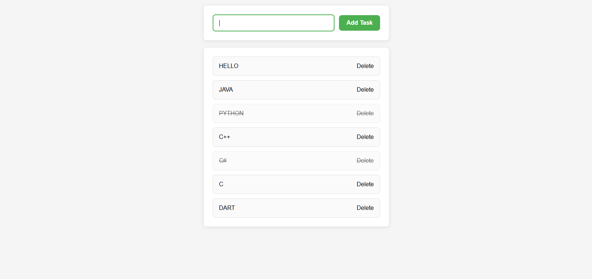

# 📝 To-Do List Web App

A clean, responsive To-Do List web application built with **HTML**, **CSS**, and **vanilla JavaScript**.  
It allows users to manage their daily tasks with a simple interface and persistent local storage.

---

## 📸 Screenshot



---

## ⚙️ Features

- ➕ Add new tasks easily  
- ✅ Mark tasks as completed  
- 🗑️ Delete tasks instantly  
- 💾 Persistent data using `localStorage`  
- 🧼 Minimal, mobile-friendly user interface  

---

## 🔧 Built With

- **HTML5** – Semantic structure  
- **CSS3** – Custom styling *(see `to-do-list.css`)*  
- **JavaScript (ES6)** – DOM manipulation & data logic  
- **localStorage** – Data persistence  

---

## 📁 Project Structure

## 📂 Project Structure

```
todo-list/
│
├── todo-list.html           # Main HTML file
├── css/
│   └── todo-list.css        # CSS styling
├── js/
│   └── todo-list.js         # Application logic
├── image/
│   └── screenshot.png       # UI screenshot
└── README.md                # Project documentation

```
